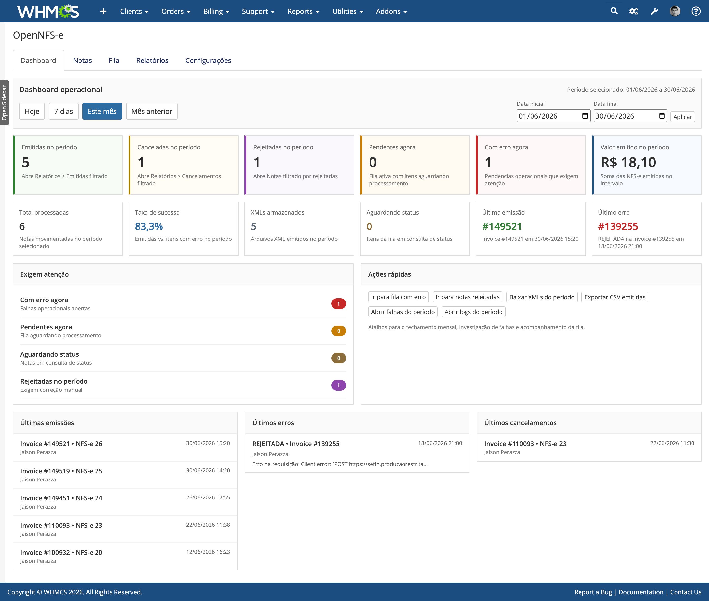

# OpenNFS-e



Addon para WHMCS com emissão de NFS-e Nacional integrada à API oficial, emissão automática quando a fatura é paga, controle de automação por gateway de pagamento, configuração de NBS e código de serviço, geração de DANFS-e em PDF, armazenamento de XML organizado por ambiente e série, consulta de status, fila de processamento e envio de XML/PDF por e-mail ao cliente.

> **Aviso importante**
>
> Este addon está em fase de testes.
>
> Antes de utilizar em produção, faça a validação completa no ambiente de homologação da NFS-e Nacional e confirme todos os fluxos operacionais, fiscais e de comunicação com o seu WHMCS.
>
> O uso deste software é por sua conta e risco. O autor não se responsabiliza por perdas, falhas operacionais, emissões incorretas, indisponibilidade, inconsistências fiscais, danos diretos ou indiretos decorrentes do uso deste addon.

## Visão Geral

- Compatível com WHMCS `8.13.x`.
- Requer PHP `8.1+`.
- Usa a SDK `nfse-nacional/nfse-php`.
- Usa `vendor-scoped` para reduzir risco de conflito com dependências de outros módulos do WHMCS.
- Permite emissão automática ao pagamento da fatura, com controle separado por gateway.
- Permite configurar código de serviço, NBS, alíquota e parâmetros tributários padrão.
- Suporta emissão de NFS-e para clientes no Brasil e no exterior.
- Gera DANFS-e em PDF e envia XML/PDF por e-mail ao cliente.
- Possui fila de processamento, cron integrado ao WHMCS e consulta automática/manual de status.
- Organiza XMLs emitidos por ambiente, série, ano e mês.

## Panorama Funcional

### Automação Fiscal
- Emissão automática de NFS-e quando a fatura é paga.
- Controle de automação separado por gateway de pagamento.
- Fila de processamento para emissões, reprocessamentos e consultas de status.
- Cron integrado ao WHMCS com proteção contra execução duplicada.

### Operação de Notas
- Emissão manual, reemissão e cancelamento de NFS-e pelo admin.
- Consulta manual e automática de status da nota.
- Emissão de NFS-e para tomadores nacionais e estrangeiros.
- Download individual de XML e PDF.
- Envio de XML e PDF por e-mail.

### Dashboard e Monitoramento
- Dashboard operacional com métricas do período.
- Indicadores de emitidas, canceladas, rejeitadas, pendentes, erros e valor emitido.
- Listas rápidas de últimas emissões, últimos erros e últimos cancelamentos.
- Atalhos para ações operacionais e fechamento mensal.

### Relatórios e Exportações
- Relatórios de NFS-e emitidas.
- Relatórios de falhas e rejeições.
- Relatórios de cancelamentos.
- Relatórios técnicos de logs com visualização detalhada de request/response.
- Exportação CSV de emitidas.
- Download em ZIP dos XMLs emitidos no período.

### Área do Cliente
- Listagem das NFS-e emitidas vinculadas ao cliente.
- Download de XML e PDF pelo cliente.
- Reenvio de XML/PDF por e-mail pelo cliente.
- Aviso configurável na área do cliente.

### Configuração e Cadastros
- Configuração de ambiente, certificado digital e dados do prestador.
- Configuração de série DPS, sequenciais e parâmetros de processamento.
- Catálogo de código de serviço e NBS.
- Mapeamento por produto, grupo e gateway.
- Configuração do DANFS-e e personalização de cabeçalho do PDF.
- Dados padrão do tomador e sincronização de municípios IBGE.
- Resolução de municípios com catálogo local alimentado por fonte IBGE e fallback via ViaCEP.
- Política de retenção de logs e fila.

## SDKs E Bibliotecas De Terceiros

Este projeto utiliza bibliotecas de terceiros para integração com a NFS-e Nacional, geração de PDF e empacotamento seguro das dependências:

- [`nfse-nacional/nfse-php`](https://github.com/nfse-nacional/nfse-php):
  SDK principal de integração com a API Nacional da NFS-e.
- [`paseto/nfse-nacional-pdf`](https://github.com/paseto/nfse-nacional-pdf):
  biblioteca base para geração do DANFS-e em PDF.
- [`humbug/php-scoper`](https://github.com/humbug/php-scoper):
  utilizada no processo de build para gerar a pasta `vendor-scoped/` e reduzir conflitos de dependências com outros módulos do WHMCS.
- [`phpunit/phpunit`](https://github.com/sebastianbergmann/phpunit):
  utilizada para testes automatizados no ambiente de desenvolvimento.
- [`squizlabs/php_codesniffer`](https://github.com/PHPCSStandards/PHP_CodeSniffer):
  utilizada para verificação de padrão de código no desenvolvimento.

## Fontes de Dados Externas

Além das SDKs e bibliotecas de aplicação, o módulo também utiliza fontes externas para enriquecer e validar dados de municípios:

- [`kelvins/municipios-brasileiros`](https://github.com/kelvins/municipios-brasileiros):
  fonte primária do catálogo de municípios e códigos IBGE usada para popular a base local do módulo.
- [`ViaCEP`](https://viacep.com.br/):
  utilizada como fallback para apoio na resolução de município/UF a partir do CEP quando necessário.

## Estrutura do Repositório

- `src/`:
  código-fonte principal do módulo.
- `assets/`:
  CSS e recursos visuais do admin/client area.
- `templates/`:
  templates da área do cliente.
- `migrations/`:
  migrations de banco do addon.
- `docs/`:
  documentação complementar técnica e operacional.
- `vendor-scoped/`:
  dependências prontas para uso no ambiente final.

## Requisitos

- PHP `^8.1`
- WHMCS `8.13.x`
- Extensões PHP exigidas pela SDK e pelo ambiente do WHMCS
- Certificado A1 válido (`.pfx` ou `.p12`)

## Instalação

1. Copie a pasta `OpenNfse` para `modules/addons/` do WHMCS.
2. Confirme que a pasta `vendor-scoped/` está presente no módulo publicado.
3. No admin do WHMCS, acesse `Configuration > System Settings > Addon Modules`.
4. Ative o addon `OpenNFS-e`.
5. Acesse `Addons > OpenNFS-e` e preencha a configuração inicial.

## Configuração Inicial

- Configure ambiente, certificado digital e dados do prestador.
- Configure a série DPS conforme a operação desejada.
- Revise as opções de fila/processamento automático.
- Salve a configuração antes de realizar testes de emissão.

## Armazenamento de Arquivos

- XMLs são gravados em:

```text
attachments/nfse/xml/{ambiente}/{serie}/{ano}/{mes}/
```

- Exemplos:

```text
attachments/nfse/xml/homologacao/900/2026/06/
attachments/nfse/xml/producao/1/2026/06/
```

- PDFs DANFS-e continuam sendo gravados em:

```text
attachments/nfse/pdf/
```

## Cron

- O addon possui integração com o cron do próprio WHMCS.
- Quando o cron principal do WHMCS roda a cada minuto, o processamento automático do módulo é disparado junto.
- O processamento respeita a configuração interna do addon e possui proteção contra execução duplicada no mesmo minuto.
- O arquivo `cron.php` do módulo permanece disponível para compatibilidade, mas a recomendação é usar o cron principal do WHMCS como origem oficial.

## Atualização de Dependências

Se você estiver trabalhando a partir do código-fonte e precisar reconstruir as dependências escopadas:

```bash
composer install
composer run scope
```

Isso reconstrói a pasta `vendor-scoped/`.

## Desenvolvimento Local

- Instalar dependências:

```bash
composer install
```

- Rodar testes:

```bash
composer test
```

- Verificar padrão de código:

```bash
composer cs:check
```

- Aplicar correções automáticas:

```bash
composer cs:fix
```

## Segurança

- O certificado A1 deve ficar fora do webroot do WHMCS.
- O diretório `attachments/` deve ser gravável pelo PHP.
- Certificados `.pfx` com criptografia antiga podem apresentar falhas de leitura ou compatibilidade no servidor.
- Não publique logs, XMLs, PDFs gerados ou credenciais.

### Certificado PFX Moderno

Se o certificado A1 estiver em um `.pfx` antigo, ele pode apresentar incompatibilidades no ambiente do servidor. Nesses casos, a recomendação é reexportar o certificado em um PFX moderno.

Se você conseguir o certificado original ou tiver acesso ao Windows onde ele foi emitido:

1. Abra `certmgr.msc`.
2. Localize o certificado desejado.
3. Exporte novamente o certificado.
4. Utilize criptografia `AES`, quando essa opção estiver disponível no assistente.
5. Gere um novo arquivo `.pfx`.

Depois disso, atualize o caminho e a senha do certificado na configuração do módulo e valide novamente o certificado no admin do WHMCS.

## Licença e Uso

Este projeto é disponibilizado para uso pessoal e uso interno por empresas, incluindo estudo, instalação e adaptação para uso próprio.

Sem autorização prévia e expressa do autor, não é permitido:

- vender este software
- revender este software
- sublicenciar este software
- redistribuir este software como produto comercial
- oferecer este software como serviço hospedado/SaaS
- comercializar versões modificadas deste software
- utilizar este software como base para produto concorrente com exploração comercial direta

Se você deseja uso comercial, revenda, sublicenciamento, distribuição paga ou incorporação em oferta comercial, obtenha autorização específica do autor.

Este projeto utiliza como base a Elastic License 2.0 (ELv2), acrescida de cláusulas específicas de não revenda. O texto formal e juridicamente válido está no arquivo [`LICENSE`](LICENSE).
